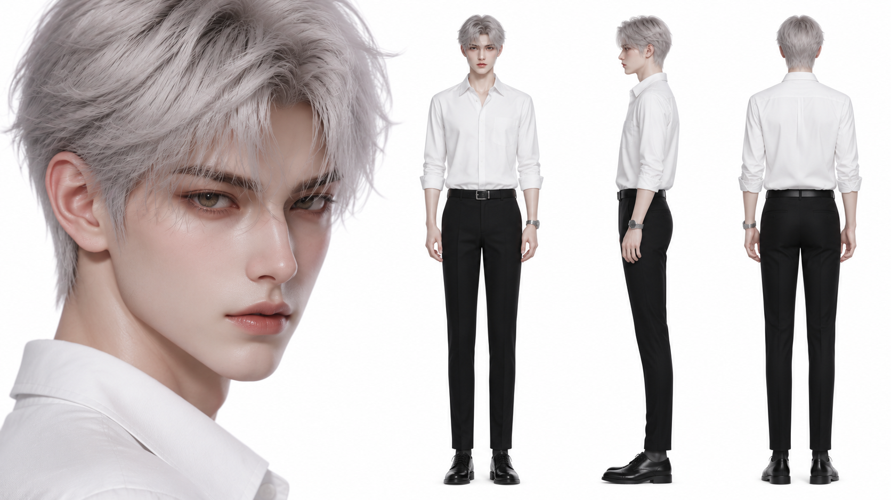
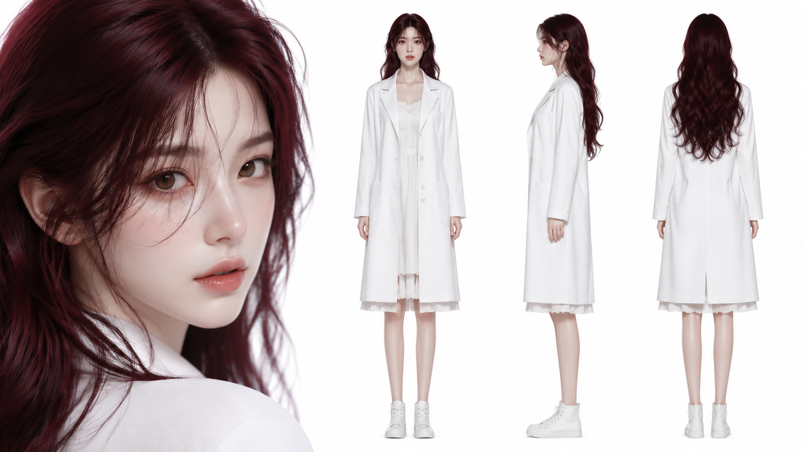
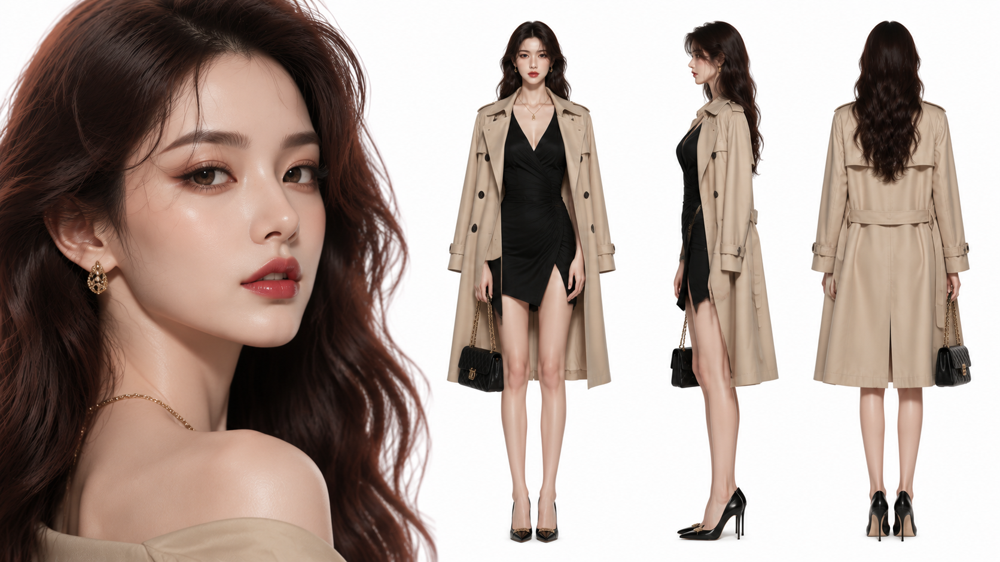
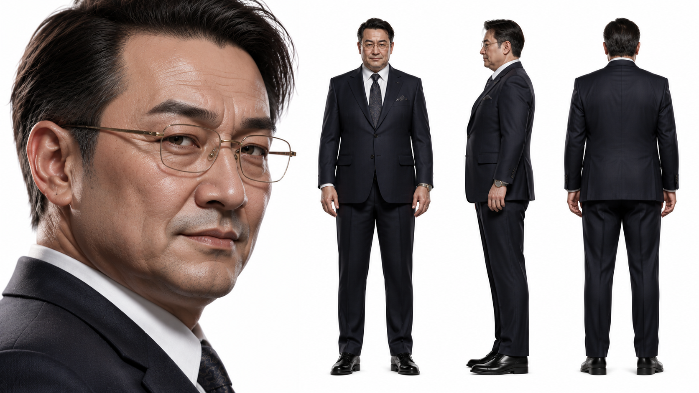
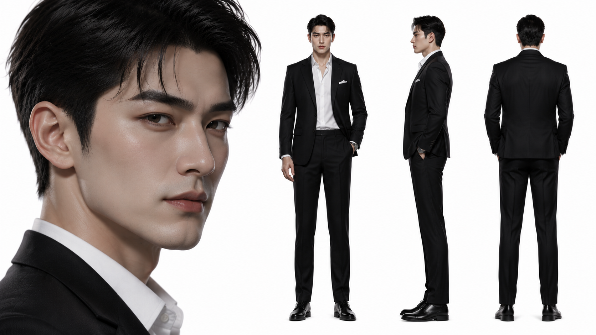
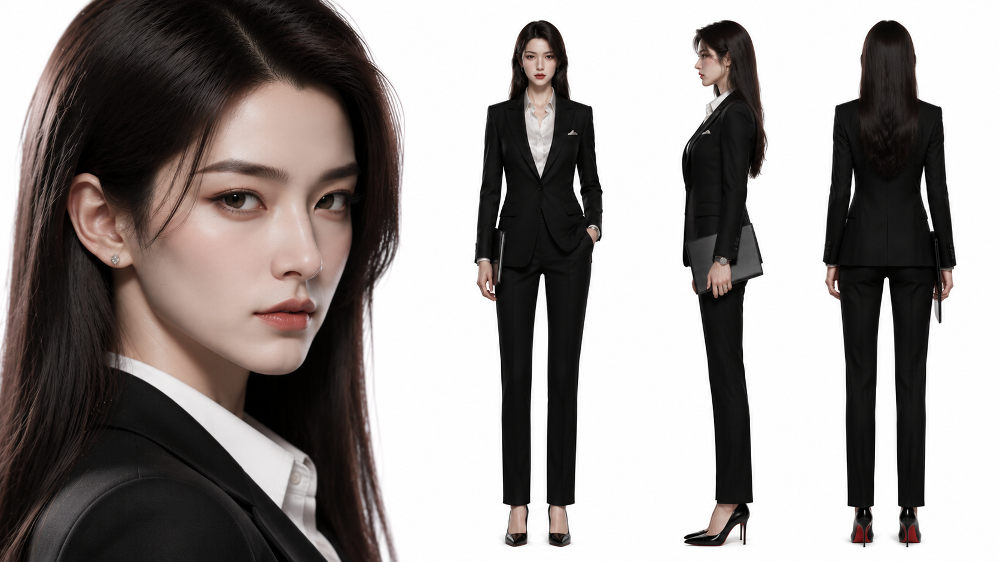
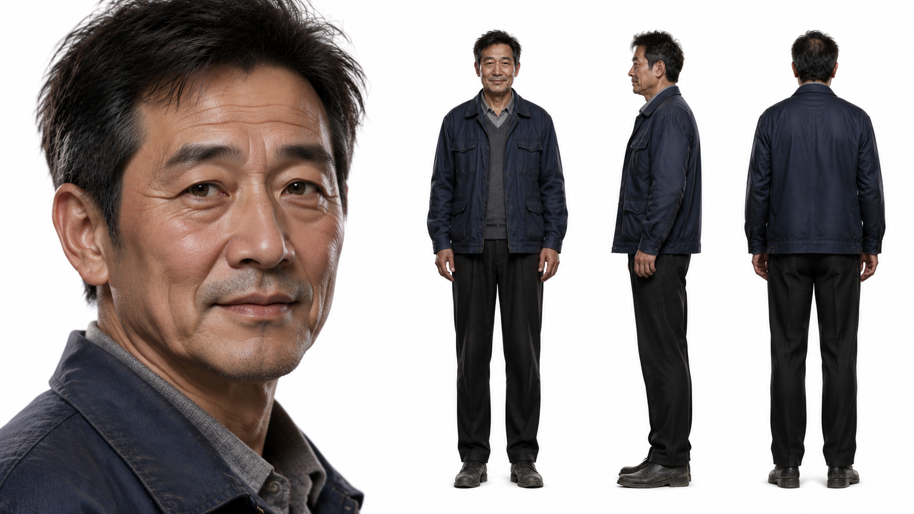

男主角

Character Design Table (Masterpiece, Best Quality, High Resolution: 1.2), 1 boy, single, extremely handsome, handsome young man, semi realistic 3D rendering, Korean webcomic style, messy silver white hair CG style, short hair, delicate pale skin, sharp jawline, delicate and beautiful light brown eyes, serious expression, slightly parted lips. Movie grade lighting, Unreal Engine 5, Octane rendering, 8K. (worst quality, low quality: 1.4), 2D, flat, anime, manga, text, watermarks, poor anatomy, poor hand depiction, missing fingers, extra fingers, unnatural skin, strange eyes, deformed faces, poorly drawn faces, mutations, ugliness.
 The AAA next-generation game cutscene features a character turning around, with the left side occupying one-third of the canvas. It features a super sized, ultra-fine close-up of the face, showcasing skin pores, eyes, eyebrows, lips, hair, and facial structure. The right side occupies two-thirds of the canvas, displaying the full body front view, left side view, and back view. Each view is perfectly aligned and proportionally balanced, presenting a neutral A-type standing posture.
 Wearing a white shirt, paired with black slim pants and a black belt, black leather shoes, and a silver mechanical watch
 Orthogonal character rotation, centered camera, symmetrical composition, studio lighting, soft shadows, physical rendering, Unreal Engine 5 graphics quality, AAA level game character design, high-end game concept art, movie level lighting, ray tracing, global illumination, subsurface scattering, surreal, realistic skin, realistic hair, realistic fabric simulation, 8K, masterpiece, sharp focus.
 Pure white seamless background, no environment, no props, no text, no logo, no watermark, no labels, no measurement lines, no design annotations, 16:9 aspect ratio.

@创建图片 Character Design Table (Masterpiece, Best Quality, High Resolution: 1.2), 1 girl, single person, extremely beautiful appearance, pretty girl, melon seed face, unrelated delicacy, semi realistic 3D rendering, Korean webcomic style, messy burgundy long hair CG style, long hair, delicate pale skin, angular jawline, delicate and beautiful light brown eyes, pure lipstick color, sweet expression, slightly parted lips. Movie grade lighting, Unreal Engine 5, Octane rendering, 8K. (worst quality, low quality: 1.4), 2D, flat, anime, manga, text, watermarks, poor anatomy, poor hand depiction, missing fingers, extra fingers, unnatural skin, strange eyes, deformed faces, poorly drawn faces, mutations, ugliness.
 The AAA next-generation game cutscene features a character turning around, with the left side occupying one-third of the canvas. It features a super sized, ultra-fine close-up of the face, showcasing skin pores, eyes, eyebrows, lips, hair, and facial structure. The right side occupies two-thirds of the canvas, displaying the full body front view, left side view, and back view. Each view is perfectly aligned and proportionally balanced, presenting a neutral A-type standing posture.
 Dressed in a white first love white dress, wearing white Converse canvas shoes but not Converse brand, and wearing a doctor's white coat
 Orthogonal character rotation, centered camera, symmetrical composition, studio lighting, soft shadows, physical rendering, Unreal Engine 5 graphics quality, AAA level game character design, high-end game concept art, movie level lighting, ray tracing, global illumination, subsurface scattering, surreal, realistic skin, realistic hair, realistic fabric simulation, 8K, masterpiece, sharp focus.
 Pure white seamless background, no environment, no props, no text, no logo, no watermark, no labels, no measurement lines, no design annotations, 16:9 aspect ratio.

Character Design Table (Masterpiece, Best Quality, High Resolution: 1.2), 1 girl, single person, extremely attractive appearance, glamorous beauty, luxury influencer style, modern urban beauty, semi realistic 3D rendering, Korean webcomic style.

26-year-old Chinese woman, elegant and fashionable appearance, oval face, delicate facial features, slightly sharp chin, high cheekbones, smooth fair skin, expressive almond-shaped eyes, dark brown eyes with confident gaze, long curled eyelashes, perfectly shaped eyebrows, small nose, full lips with glossy rose lipstick, subtle luxury makeup, sophisticated feminine aura.

Long wavy dark brown hair with slightly warm chestnut highlights, silky hair texture, fashionable layered hairstyle, perfectly styled hair, high-end beauty influencer appearance.

Her expression is confident and slightly arrogant, charming smile, subtle superiority expression, slightly raised eyebrow, showing a beautiful but materialistic personality.

Body:
 170cm tall, slim figure, elegant posture, long legs, graceful feminine silhouette, fashion model proportions.

Clothing:
 luxury fashion style, fitted black designer-style dress, beige luxury trench coat hanging naturally over shoulders, delicate gold necklace, elegant earrings, luxury handbag, high heels, fashionable urban elite woman style.

The AAA next-generation game cutscene features a character turnaround.

The left side occupies one-third of the canvas:
 a super sized ultra-detailed facial close-up, showcasing realistic skin pores, glossy lips, detailed eyelashes, eye expression, eyebrow shape, facial structure, silky hair strands and makeup details.

The right side occupies two-thirds of the canvas:
 full body front view, left side view, and back view, perfectly aligned, same character proportions, balanced spacing, neutral A-pose standing posture.

Orthographic character rotation, centered camera, symmetrical composition, studio lighting, soft shadows, physical based rendering, Unreal Engine 5 graphics quality, AAA level game character design, high-end game concept art, cinematic movie lighting, ray tracing, global illumination, subsurface scattering, realistic skin texture, realistic hair simulation, realistic fabric simulation, 8K, masterpiece, sharp focus.

Pure white seamless background, no environment, no props, no text, no logo, no watermark, no labels, no measurement lines, no design annotations, 16:9 aspect ratio.

(worst quality, low quality: 1.4),
 2D, flat illustration, anime, manga, cartoon, childish style, text, watermark, logo, poor anatomy, bad hands, missing fingers, extra fingers, deformed body, unnatural face, asymmetrical eyes, strange eyes, ugly face, old woman, excessive wrinkles, unrealistic makeup, exaggerated expression, distorted proportions.

@创建图片 Character Design Table (Masterpiece, Best Quality, High Resolution: 1.2), 1 girl, single person, extremely attractive appearance, glamorous beauty, luxury influencer style, modern urban beauty, semi realistic 3D rendering, Korean webcomic style.

26-year-old Chinese woman, elegant and fashionable appearance, oval face, delicate facial features, slightly sharp chin, high cheekbones, smooth fair skin, expressive almond-shaped eyes, dark brown eyes with confident gaze, long curled eyelashes, perfectly shaped eyebrows, small nose, full lips with glossy rose lipstick, subtle luxury makeup, sophisticated feminine aura.

Long wavy dark brown hair with slightly warm chestnut highlights, silky hair texture, fashionable layered hairstyle, perfectly styled hair, high-end beauty influencer appearance.

Her expression is confident and slightly arrogant, charming smile, subtle superiority expression, slightly raised eyebrow, showing a beautiful but materialistic personality.

Body:
 170cm tall, slim figure, elegant posture, long legs, graceful feminine silhouette, fashion model proportions.

Clothing:
 luxury fashion style, fitted black designer-style dress, beige luxury trench coat hanging naturally over shoulders, delicate gold necklace, elegant earrings, luxury handbag, high heels, fashionable urban elite woman style.

The AAA next-generation game cutscene features a character turnaround.

The left side occupies one-third of the canvas:
 a super sized ultra-detailed facial close-up, showcasing realistic skin pores, glossy lips, detailed eyelashes, eye expression, eyebrow shape, facial structure, silky hair strands and makeup details.

The right side occupies two-thirds of the canvas:
 full body front view, left side view, and back view, perfectly aligned, same character proportions, balanced spacing, neutral A-pose standing posture.

Orthographic character rotation, centered camera, symmetrical composition, studio lighting, soft shadows, physical based rendering, Unreal Engine 5 graphics quality, AAA level game character design, high-end game concept art, cinematic movie lighting, ray tracing, global illumination, subsurface scattering, realistic skin texture, realistic hair simulation, realistic fabric simulation, 8K, masterpiece, sharp focus.

Pure white seamless background, no environment, no props, no text, no logo, no watermark, no labels, no measurement lines, no design annotations, 16:9 aspect ratio.

(worst quality, low quality: 1.4),
 2D, flat illustration, anime, manga, cartoon, childish style, text, watermark, logo, poor anatomy, bad hands, missing fingers, extra fingers, deformed body, unnatural face, asymmetrical eyes, strange eyes, ugly face, old woman, excessive wrinkles, unrealistic makeup, exaggerated expression, distorted proportions.

@创建图片 Character Design Table (Masterpiece, Best Quality, High Resolution: 1.2), 1 man, single person, middle-aged Chinese businessman, powerful corporate executive appearance, semi realistic 3D rendering, Korean webcomic style, AAA next-generation game character design. 45-year-old Chinese male, 178cm tall, slightly overweight businessman body shape, broad shoulders, slightly round belly, mature masculine appearance, square face, wide forehead, thick eyebrows, deep-set eyes, medium nose, thin lips, slightly rough skin texture, subtle wrinkles around eyes and forehead, realistic middle-aged facial details. Short black hair with slight gray strands, neatly combed hairstyle, slightly receding hairline, clean shaved face, sharp but tired eyes, confident expression with hidden arrogance, fake friendly smile, intimidating workplace executive aura. Personality expression: A successful but oppressive company boss, experienced corporate manager, manipulative personality, arrogant confidence, controlling attitude, a person who looks polite but secretly looks down on ordinary employees. Body: medium height, slightly overweight build, businessman posture, slightly forward shoulders, authoritative standing posture, realistic middle-aged proportions. Clothing: dark navy tailored business suit, white dress shirt, luxury silk tie, expensive mechanical watch, polished leather shoes, gold rim glasses, high-quality but slightly old-fashioned executive fashion style. The AAA next-generation game cutscene features a character turnaround. The left side occupies one-third of the canvas: a super sized ultra-detailed facial close-up, showcasing realistic skin pores, wrinkles, eyes, eyebrows, nose, lips, hair texture, facial structure and subtle arrogant expression details. The right side occupies two-thirds of the canvas: full body front view, left side view, and back view, perfectly aligned, same character proportions, balanced spacing, neutral A-pose standing posture. Orthographic character rotation, centered camera, symmetrical composition, studio lighting, soft shadows, physically based rendering, Unreal Engine 5 graphics quality, AAA level game character design, high-end game concept art, cinematic movie lighting, ray tracing, global illumination, subsurface scattering, realistic skin texture, realistic hair simulation, realistic fabric simulation, 8K, masterpiece, sharp focus. Pure white seamless background, no environment, no props, no text, no logo, no watermark, no labels, no measurement lines, no design annotations, 16:9 aspect ratio.  (worst quality, low quality: 1.4), 2D, flat illustration, anime, manga, cartoon, young face, handsome young man, muscular bodybuilder, exaggerated villain face, monster face, ugly face, distorted anatomy, bad hands, missing fingers, extra fingers, deformed body, unnatural skin, strange eyes, unrealistic wrinkles, poor facial details, low resolution, blurry, text, watermark, logo.

@创建图片 Character Design Table (Masterpiece, Best Quality, High Resolution: 1.2), 1 man, single person, extremely handsome appearance, young wealthy heir, elite rich second generation, luxury businessman style, semi realistic 3D rendering, Korean webcomic style. 28-year-old Chinese male, tall and elegant body shape, 185cm height, athletic slim physique, broad shoulders, long legs, perfect masculine proportions. Handsome oval face with sharp jawline, high cheekbones, straight nose bridge, deep-set dark brown eyes, thick eyebrows, confident gaze, slightly arrogant expression, mature masculine facial features, smooth fair skin, clean-shaven face. Short black hair with natural texture, slightly styled back hair, expensive gentleman hairstyle, neat and confident appearance. His facial expression shows superiority and self-confidence, a subtle mocking smile, calm but intimidating eyes, showing the aura of a wealthy young master who looks down on ordinary people. Wearing a luxury black tailored suit, white dress shirt, no tie, expensive mechanical watch, luxury leather shoes, subtle designer accessories, rich family heir style, modern elite fashion. Body posture: confident standing posture, relaxed shoulders, one hand in pocket, elegant but dominant body language. The AAA next-generation game cutscene features a character turning around, with the left side occupying one-third of the canvas. It features a super sized, ultra-fine close-up of the face, showcasing realistic skin pores, eyes, eyebrows, lips, hair texture, facial structure, sharp jawline and arrogant expression details. The right side occupies two-thirds of the canvas, displaying the full body front view, left side view, and back view. Each view is perfectly aligned and proportionally balanced, presenting a neutral A-type standing posture. Orthographic character rotation, centered camera, symmetrical composition, studio lighting, soft shadows, physical rendering, Unreal Engine 5 graphics quality, AAA level game character design, high-end game concept art, movie grade lighting, ray tracing, global illumination, subsurface scattering, realistic skin texture, realistic hair strands, realistic fabric simulation, Octane rendering, 8K, masterpiece, sharp focus. Pure white seamless background, no environment, no props, no text, no logo, no watermark, no labels, no measurement lines, no design annotations, 16:9 aspect ratio.  (worst quality, low quality: 1.4),  2D, flat, anime, manga, cartoon, illustration, text, watermark, logo, poor anatomy, poor hand depiction, missing fingers, extra fingers, unnatural skin, strange eyes, deformed face, poorly drawn face, mutation, ugly, old man, fat body, muscular bodybuilder, exaggerated facial expression, messy clothes, cheap fashion.

Character Design Table (Masterpiece, Best Quality, High Resolution: 1.2), 1 woman, single person, extremely beautiful appearance, elegant female CEO, powerful businesswoman, luxury executive style, mature beauty, semi realistic 3D rendering, Korean webcomic style. 30-year-old Chinese woman, tall and elegant figure, 175cm height, slim but graceful body shape, perfect feminine proportions, long legs, confident posture, sophisticated and professional aura. Beautiful oval face with sharp jawline, high cheekbones, refined facial features, elegant eyebrows, deep dark brown eyes, calm and intelligent gaze, straight nose bridge, natural pink lips, delicate fair skin, realistic skin texture, mature feminine beauty. Long straight black hair, silky smooth hair strands, middle part hairstyle, neat and professional hairstyle, elegant CEO appearance. Her expression shows confidence, intelligence and authority, calm cold expression, slightly serious eyes, subtle composed expression, showing the aura of a powerful woman who controls a company. Wearing a luxury black business suit, white silk shirt, fitted blazer, elegant high heels, minimalist diamond earrings, luxury mechanical watch, professional CEO fashion style, high-end corporate executive appearance. Body posture: confident standing posture, straight back, one hand holding documents, one hand relaxed naturally, elegant and powerful body language. The AAA next-generation game cutscene features a character turning around, with the left side occupying one-third of the canvas. It features a super sized, ultra-fine close-up of the face, showcasing realistic skin pores, eyes, eyebrows, lips, hair texture, facial structure, elegant expression and refined makeup details. The right side occupies two-thirds of the canvas, displaying the full body front view, left side view, and back view. Each view is perfectly aligned and proportionally balanced, presenting a neutral A-type standing posture. Orthographic character rotation, centered camera, symmetrical composition, studio lighting, soft shadows, physical rendering, Unreal Engine 5 graphics quality, AAA level game character design, high-end game concept art, movie grade lighting, ray tracing, global illumination, subsurface scattering, realistic skin texture, realistic hair strands, realistic fabric simulation, Octane rendering, 8K, masterpiece, sharp focus. Pure white seamless background, no environment, no props, no text, no logo, no watermark, no labels, no measurement lines, no design annotations, 16:9 aspect ratio.  (worst quality, low quality: 1.4),  2D, flat, anime, manga, cartoon, illustration, text, watermark, logo, poor anatomy, poor hand depiction, missing fingers, extra fingers, unnatural skin, strange eyes, deformed face, poorly drawn face, mutation, ugly, old woman, excessive wrinkles, childish appearance, exaggerated makeup, sexy pose, casual clothes, messy hair, cheap fashion.@创建图片 

@创建图片 Character Design Table (Masterpiece, Best Quality, High Resolution: 1.2), 1 man, single person, elderly Chinese father character, realistic ordinary working-class man, warm father figure, emotional supporting character, semi realistic 3D rendering, Korean webcomic style. 58-year-old Chinese man, average height 172cm, slightly thin body shape, hardworking appearance, ordinary worker background, slightly hunched shoulders from years of labor, natural aging signs. Kind and weathered face, slightly square face shape, subtle wrinkles around eyes and forehead, sun-tanned skin, realistic skin texture, gentle deep-set eyes, thick eyebrows with gray hair, slightly rough hands, simple and honest facial features. Short black and gray mixed hair, slightly messy natural hairstyle, realistic aging hair texture, clean and simple appearance. His expression shows kindness, patience and fatherly warmth, calm eyes with a hint of tiredness, gentle smile, strong but humble personality, a father who silently supports his family. Wearing simple dark blue work jacket, faded gray sweater underneath, plain black trousers, old but clean casual shoes, simple working-class clothing style, realistic everyday appearance. Body posture: natural standing posture, slightly relaxed shoulders, hands placed naturally in front of body, humble and peaceful body language. The AAA next-generation game cutscene features a character turning around, with the left side occupying one-third of the canvas. It features a super sized, ultra-fine close-up of the face, showcasing realistic skin pores, wrinkles, eyes, eyebrows, hair texture, facial structure, emotional expression and aging details. The right side occupies two-thirds of the canvas, displaying the full body front view, left side view, and back view. Each view is perfectly aligned and proportionally balanced, presenting a neutral A-type standing posture. Orthographic character rotation, centered camera, symmetrical composition, studio lighting, soft shadows, physical rendering, Unreal Engine 5 graphics quality, AAA level game character design, high-end game concept art, movie grade lighting, ray tracing, global illumination, subsurface scattering, realistic skin texture, realistic hair strands, realistic fabric simulation, Octane rendering, 8K, masterpiece, sharp focus. Pure white seamless background, no environment, no props, no text, no logo, no watermark, no labels, no measurement lines, no design annotations, 16:9 aspect ratio.  (worst quality, low quality: 1.4),  2D, flat, anime, manga, cartoon, illustration, text, watermark, logo, poor anatomy, poor hand depiction, missing fingers, extra fingers, unnatural skin, strange eyes, deformed face, poorly drawn face, mutation, ugly, extremely old, homeless appearance, dirty clothes, exaggerated wrinkles, cartoon elderly man.

